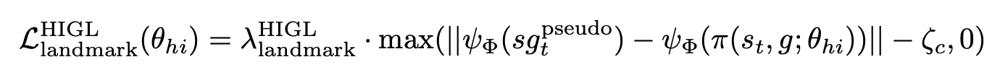
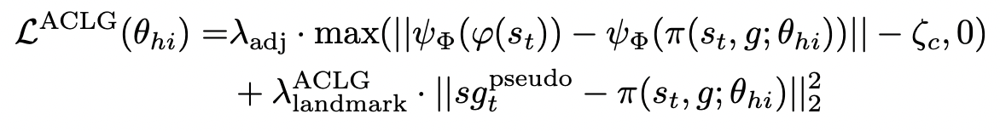

# ACLG
This is a PyTorch implementation of ACLG, initially introduced in our paper: [Guided Cooperation in Hierarchical Reinforcement Learning via Model-based Rollout](https://drive.google.com/file/d/1eQnR-YuLYBLny6cKHkgSPNATI5l6hL3j/view?usp=sharing).

Our code is based on official implementation of [HIGL](https://github.com/junsu-kim97/HIGL) (NeurIPS 2021).

> ACLG is a disentangled variant of HIGL[1]. In HIGL, Kim et al. employed the adjacency constraint to encourage the generated subgoals to be in the c-step adjacent region to the planned landmark. However, the entanglement between the adjacency constraint and landmark-based planning limited the performance of HIGL. Inspired by PIG[2], we proposed a disentangled variant of HIGL. 

Specifically, the original landmark loss of HIGL is formulated as:



In ACLG, that is re-formulated as:



The (1) number of landmarks and the (2) balancing coefficient for the landmark loss have been recalibrated on the Ant Maze (sparse, U-shape):

|(1) Number of Landmarks|$(2) \lambda^{\rm ACLG}_{\rm landmark}$|
|---|---|
|  |  |

> ---
> [1] Junsu Kim, Younggyo Seo, and Jinwoo Shin. Landmark-guided subgoal generation in hi- erarchical reinforcement learning. Advances in Neural Information Processing Systems, 34: 28336–28349, 2021.

> [2] Junsu Kim, Younggyo Seo, Sungsoo Ahn, Kyunghwan Son, and Jinwoo Shin. Imitating graph- based planning with goal-conditioned policies. In The Eleventh International Conference on Learning Representations, 2022.

## Installation
```
conda create -n higl python=3.6
conda activate higl
./install_all.sh
```

Also, to run the MuJoCo experiments, a license is required (see [here](https://www.roboti.us/license.html)).

## Usage
### Training & Evaluation
- Point Maze
```
./scripts/aclg_point_maze.sh ${reward_shaping} ${timesteps} ${gpu} ${seed}
./scripts/aclg_point_maze.sh dense 5e5 0 2
./scripts/aclg_point_maze.sh sparse 5e5 0 2
```

- Ant Maze (U-shape)
```
./scripts/aclg_ant_maze_u.sh ${reward_shaping} ${timesteps} ${gpu} ${seed}
./scripts/aclg_ant_maze_u.sh dense 10e5 0 2
./scripts/aclg_ant_maze_u.sh sparse 10e5 0 2
```

- Ant Maze (W-shape)
```
./scripts/aclg_ant_maze_w.sh ${reward_shaping} ${timesteps} ${gpu} ${seed}
./scripts/aclg_ant_maze_w.sh dense 10e5 0 2
./scripts/aclg_ant_maze_w.sh sparse 10e5 0 2
```

- Reacher & Pusher
```
./scripts/aclg_fetch.sh ${env} ${timesteps} ${gpu} ${seed}
./scripts/aclg_fetch.sh Reacher3D-v0 5e5 0 2
./scripts/aclg_fetch.sh Pusher-v0 10e5 0 2
```

- Stochastic Ant Maze (U-shape)
```
./scripts/aclg_ant_maze_u_stoch.sh ${reward_shaping} ${timesteps} ${gpu} ${seed}
./scripts/aclg_ant_maze_u_stoch.sh dense 10e5 0 2
./scripts/aclg_ant_maze_u_stoch.sh sparse 10e5 0 2
```

- Large Ant Maze (U-shape)
```
./scripts/aclg_ant_maze_u_large.sh ${reward_shaping} ${timesteps} ${gpu} ${seed}
./scripts/aclg_ant_maze_u_large.sh dense 12e5 0 2
./scripts/aclg_ant_maze_u_large.sh sparse 12e5 0 2
```

- Ant Maze Bottleneck
```
./scripts/aclg_ant_maze_bottleneck.sh ${reward_shaping} ${timesteps} ${gpu} ${seed}
./scripts/aclg_ant_maze_bottleneck.sh dense 7e5 0 2
./scripts/aclg_ant_maze_bottleneck.sh sparse 7e5 0 2
```

- Ant Maze Complex
```
./scripts/aclg_ant_maze_complex.sh ${reward_shaping} ${timesteps} ${gpu} ${seed}
./scripts/aclg_ant_maze_complex.sh dense 30e5 0 2
./scripts/aclg_ant_maze_complex.sh sparse 30e5 0 2
```